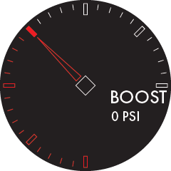

  

<h1 align="center">Multigauge</h1>

  <em> <a href="https://www.multi-gauge.com/"><b>Multigauge</b></a> is a platform-agnostic <b>automotive gauge rendering engine</b> for building highly customizable, data-driven digital dashboards. It aims to make custom instrumentation both <b>powerful</b> and <b>aesthetically pleasing.</b></em>

## About

`multigauge-core` is the shared C++ engine responsible for rendering, layout,
JSON-defined gauge structure, and editor-facing metadata.

## Demos

I should put some demos here...

## Features

- JSON-defined gauge layouts
- Platform-agnostic rendering architecture
- Various reusable gauge elements [(see the list)](./docs/elements.md) and styling options
- Built-in editor metadata and serialization support
- Support for embedded and web-based targets

## Targets

`multigauge-core` is designed to be target-agnostic. Each target provides the platform-specific runtime, rendering backend,
and system integration required to run gauges.

### Current targets

- [ESP32](https://github.com/bluesqqq/multigauge-esp32)
- [WASM](https://github.com/bluesqqq/website-multigauge)  
  Currently lives in the website repository, but will likely be split into its own repo later.

### Planned targets

Roughly in order of priority:

- Raspberry Pi
- STM32
- Arduino
- Android
- Windows simulator

## Implementing a New Target

New targets are not just welcome but encouraged! `multigauge-core` is built to support multiple platforms, and adding a new implementation mainly involves providing the platform-specific
services required by the core engine.

At a minimum, a target implementation should provide:

- a [`GraphicsContext`](./include/multigauge/graphics/GraphicsContext.h) for rendering
- a [`FileSystem`](./include/multigauge/io/FileSystem.h) for loading files and assets
- a [`Time`](./include/multigauge/io/Time.h) implementation for timing
- (optional) a [`Logger`](./include/multigauge/io/Logger.h) for diagnostics

These services are grouped together through [`Platform`](./include/multigauge/Platform.h), which must be set before using the core API.

See [Porting](./docs/porting.md) for more information.

## Dependencies

`multigauge-core` depends on a small set of third-party libraries:

- [`RapidJSON 1.1.0`](https://github.com/Tencent/rapidjson) for JSON parsing and serialization
- [`Yoga`](https://github.com/facebook/yoga) for layout calculation
- [`lodepng`](https://github.com/lvandeve/lodepng) for PNG decoding
- [`tjpgd`](https://elm-chan.org/fsw/tjpgd/) for JPEG decoding

These are currently vendored in the [`lib/`](./lib) directory.

## Status

`multigauge-core` and its targets are actively under development. The architecture is in place, but breaking changes may still occur as the project evolves.

⚠️ If you plan to build on top of the project at this stage, be aware that APIs, file formats, and integration details are <b>very</b> likely to change. You should expect to update your code as the project matures.

## License

This project is free to use for personal, educational, and non-commercial purposes.

You may not use this code in any product or service that is sold or monetized
without permission.

If you're unsure whether your use case is allowed, feel free to reach out.
