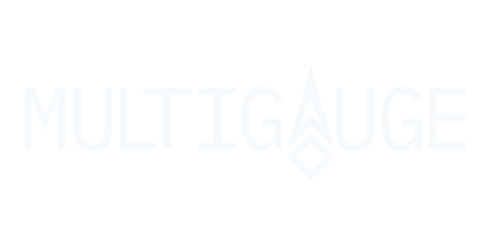

<p align="center">
  <a href="https://www.multi-gauge.com/">
    <picture>
      <source media="(prefers-color-scheme: dark)" srcset="./assets/multigauge-wordmark-light.png">
      <source media="(prefers-color-scheme: light)" srcset="./assets/multigauge-wordmark-dark.png">
      
    </picture>
  </a>
</p>

<p align="center">
  <em>
    <a href="https://www.multi-gauge.com/"><b>Multigauge</b></a> is a platform-agnostic
    <b>automotive gauge rendering engine</b> for building highly customizable, data-driven digital dashboards.
    It aims to make custom instrumentation both <b>powerful</b> and <b>aesthetically pleasing</b>.
  </em>
</p>

## Repository Layout

```text
multigauge/
|-- core/             shared C++ engine
|-- ports/            platform targets
|   |-- esp32/        embedded firmware target
|   `-- web/          standalone web/WASM target
|-- apps/             product apps built on top of Multigauge
|   `-- website/      public website and community/workshop app
|-- VERSION           current repository-wide release version
`-- .github/workflows/ CI/CD workflows
```

Release process details are in [`docs/releasing.md`](docs/releasing.md).

## What Lives Where

- `core/` contains the portable gauge engine and shared rendering logic.
- `ports/esp32/` contains the firmware target.
- `ports/web/` contains the standalone local web build for the WASM target.
- `apps/website/` contains the Flask website, including:
  - the homepage
  - workshop/community pages
  - account pages
  - the firmware downloads page at `/downloads`

## Ports

### Current Ports

- `ports/esp32/` - ESP32 embedded implementation
- `ports/web/` - WebAssembly/web implementation

### Planned Ports

Roughly in order of priority:

- Linux
- STM32
- Arduino
- Windows

## Status

`multigauge` and its targets are actively under development. The core architecture is in place,
but breaking changes may still occur as the project evolves.

APIs, file formats, target integrations, website routes, and editor-facing metadata are likely to change.

## License

This project is free to use for personal, educational, and non-commercial purposes.

You may not use this code in any product or service that is sold or monetized without permission.

If you're unsure whether your use case is allowed, feel free to reach out.
